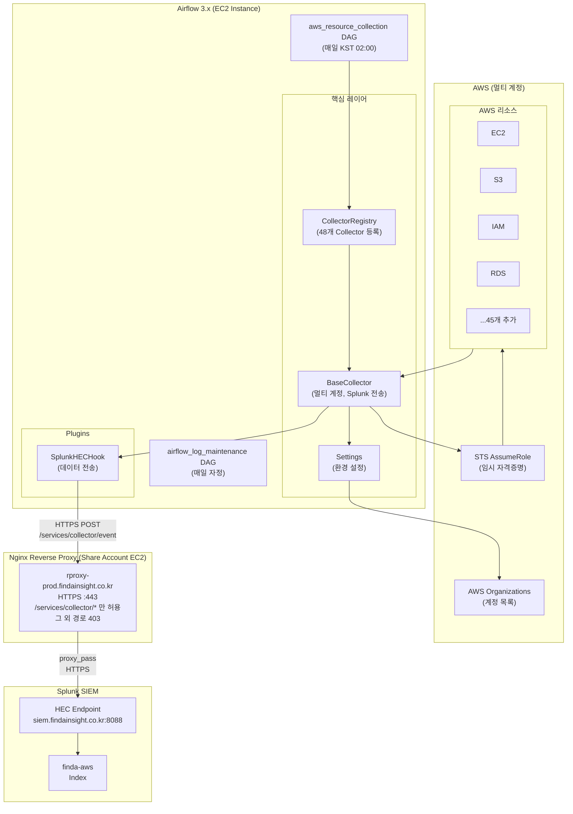
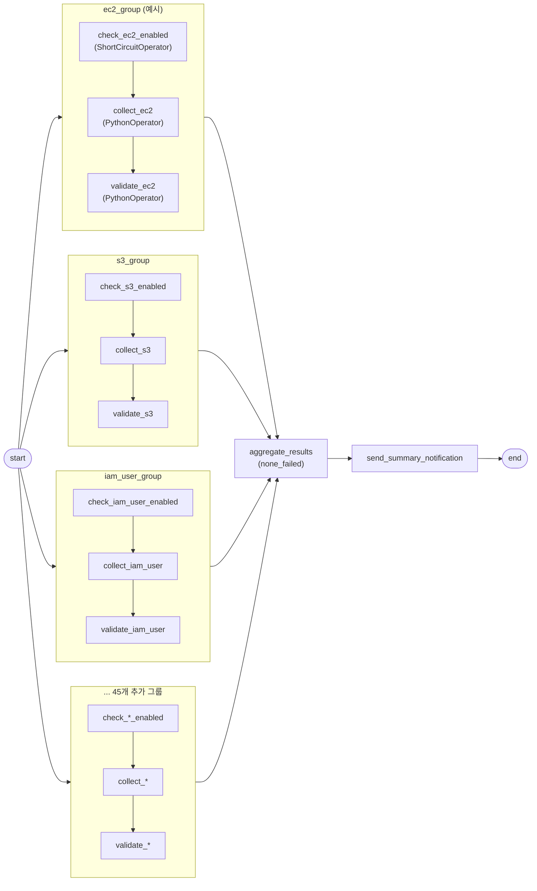
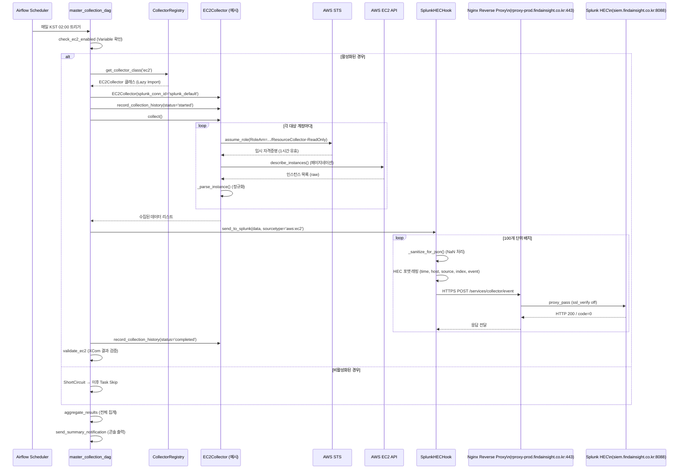
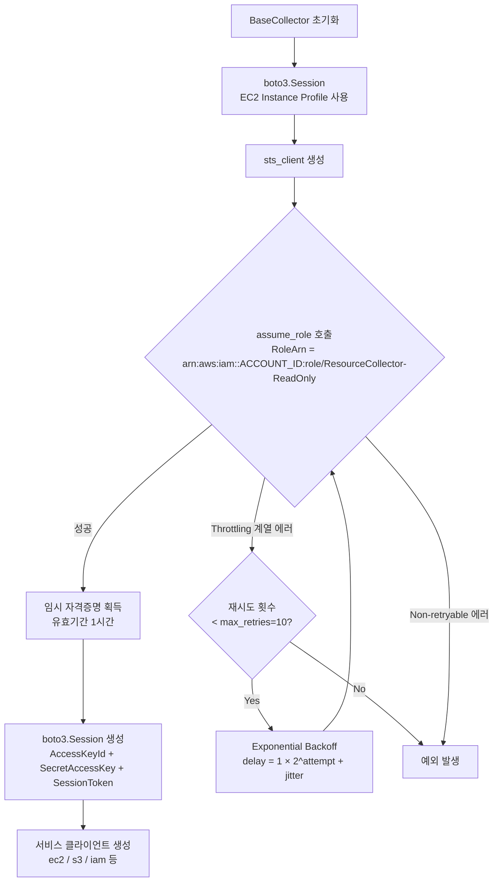
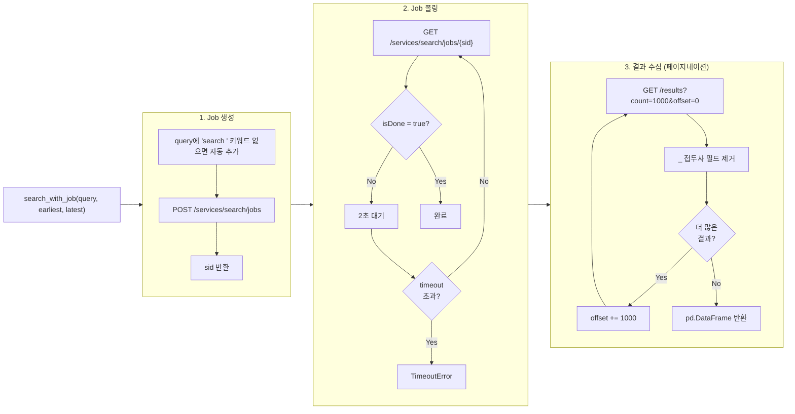

# finda-secops-airflow 시스템 기술 문서

## 목차

1. [시스템 개요](#1-시스템-개요)
2. [전체 아키텍처](#2-전체-아키텍처)
3. [디렉터리 구조](#3-디렉터리-구조)
4. [핵심 컴포넌트](#4-핵심-컴포넌트)
   - [Settings](#41-settings--configsettingspy)
   - [CollectorRegistry](#42-collectorregistry--configcollector_registrypy)
   - [BaseCollector](#43-basecollector--collectorbase_collectorpy)
   - [SplunkHECHook](#44-splunkhechook--pluginssplunk_hec_hookpy)
   - [SplunkSearchHook](#45-splunksearchhook--pluginssplunk_search_hookpy)
5. [DAG 상세](#5-dag-상세)
   - [aws_resource_collection](#51-aws_resource_collection)
   - [airflow_log_maintenance](#52-airflow_log_maintenance)
6. [데이터 플로우](#6-데이터-플로우)
   - [AWS 자산 수집 전체 플로우](#61-aws-자산-수집-전체-플로우)
   - [STS AssumeRole 인증 플로우](#62-sts-assumerole-인증-플로우)
   - [Splunk HEC 전송 플로우](#63-splunk-hec-전송-플로우)
   - [Splunk Search 플로우](#64-splunk-search-플로우)
7. [설정 참조](#7-설정-참조)
8. [Airflow 3.x 주요 변경사항](#8-airflow-3x-주요-변경사항)

---

## 1. 시스템 개요

finda-secops-airflow는 **AWS 멀티 계정 환경의 보안 자산을 자동 수집하여 Splunk로 전송**하는 Airflow 기반 파이프라인입니다.

**핵심 기능:**

| 기능 | 설명 |
|---|---|
| AWS 자산 수집 | 48개 리소스 타입(EC2, S3, IAM, RDS 등)을 전 계정 대상으로 매일 수집 |
| Splunk 연동 | 수집된 데이터를 HEC(HTTP Event Collector)를 통해 Splunk로 배치 전송 |
| 멀티 계정 지원 | STS AssumeRole 기반 교차 계정 접근, Exponential Backoff 재시도 |

---

## 2. 전체 아키텍처



---

## 3. 디렉터리 구조

```
SECOPS-63/
├── collectors/               # 48개 AWS 리소스별 Collector 클래스
│   ├── base_collector.py     # 모든 Collector의 추상 부모 클래스
│   ├── ec2_collector.py
│   ├── s3_collector.py
│   ├── iam_user_collector.py
│   └── ...
├── config/
│   ├── settings.py           # AWS 리전/Role, Splunk, 계정 설정 관리
│   └── collector_registry.py # 48개 Collector 등록 및 Lazy Import
├── plugins/
│   ├── aws_assume_role_hook.py  # STS AssumeRole Airflow Hook
│   ├── splunk_hec_hook.py       # Splunk HEC 데이터 전송 Hook
│   └── splunk_search_hook.py    # Splunk REST API 검색 Hook
├── dags/
│   ├── master_collection_dag.py         # AWS 자산 수집 통합 DAG
│   └── maintenance_dag.py               # Airflow 로그 정리 DAG
└── docs/
    └── AIRFLOW_3_MIGRATION.md           # 이 문서
```

---

## 4. 핵심 컴포넌트

### 4.1 Settings — `config/settings.py`

시스템 전반의 설정을 중앙 관리하는 클래스입니다. 하드코딩 없이 **Airflow Variable → 환경 변수** 순으로 폴백하여 설정을 로드합니다.

```python
class Settings:
    AWS_DEFAULT_REGION = os.getenv('AWS_DEFAULT_REGION', 'ap-northeast-2')
    TARGET_ROLE_NAME = os.getenv('TARGET_ROLE_NAME', 'ResourceCollector-ReadOnly')

    @staticmethod
    def get_target_accounts() -> dict:
        # 1순위: Airflow Variable 'target_aws_accounts' (JSON)
        # 2순위: 환경 변수 'TARGET_AWS_ACCOUNTS' (JSON)
        # 미설정 시: BaseCollector가 AWS Organizations API로 Fallback
        ...
```

**주요 메서드:**

| 메서드 | 반환값 | 설명 |
|---|---|---|
| `get_target_accounts()` | `dict` | `{계정명: 계정ID}` 형태의 대상 계정 목록 |
| `get_splunk_index(conn_id)` | `str` | Airflow Connection Extra에서 Splunk 인덱스 로드 |
| `get_splunk_config(conn_id)` | `dict` | HEC host/port/token/index 설정 전체 반환 |

---

### 4.2 CollectorRegistry — `config/collector_registry.py`

48개 Collector를 **Lazy Import** 방식으로 등록합니다. DAG 파싱 시점이 아닌 Task 실행 시점에 모듈을 import하기 때문에, 특정 Collector의 오류가 DAG 전체 로딩 실패로 번지지 않습니다.

```python
COLLECTORS_CONFIG = {
    'ec2': {
        'collector_class': 'collectors.ec2_collector.EC2Collector',  # 문자열로 저장
        'description': 'EC2 Instance',
        'splunk_sourcetype': 'aws:ec2',
    },
    # ... 47개 추가
}

def get_collector_class(config: dict):
    """Task 실행 시점에 importlib으로 동적 로드"""
    full_path = config['collector_class']
    module_path, class_name = full_path.rsplit('.', 1)
    module = importlib.import_module(module_path)
    return getattr(module, class_name)
```

**등록된 48개 Collector:**

| 카테고리 | Sourcetype |
|---|---|
| **Compute** | EC2, Lambda, EKS, EMR, Bedrock |
| **Storage** | S3, S3 Metrics, EBS, EFS |
| **Database** | RDS, DynamoDB, ElastiCache, Redshift, OpenSearch |
| **Network** | Security Group, VPC Endpoint, NAT Gateway, EIP, ENI, VPN, Route Table, NACL, Transit Gateway, ELB |
| **IAM/Identity** | IAM User, IAM Role, IAM Policy, IAM Group, IAM Account, Identity Center, Keycloak |
| **Security** | KMS, Secrets Manager, ACM, GuardDuty, CloudTrail, AWS Config |
| **Messaging** | SNS, SQS, Kinesis, MSK |
| **Other** | ECR, API Gateway, CloudFront, Route53, Cost Explorer, AMI |

---

### 4.3 BaseCollector — `collectors/base_collector.py`

모든 Collector의 공통 기능을 제공하는 추상 기반 클래스입니다. 멀티 계정 인증, Splunk 전송, 수집 이력 로깅을 담당합니다.

```python
class BaseCollector:
    def __init__(self, target_accounts=None, target_role_name=None,
                 splunk_conn_id='splunk_default'):
        self.target_role_name = target_role_name or Settings.TARGET_ROLE_NAME
        self.base_session = boto3.Session()   # EC2 Instance Profile 기반
        self.sts_client = self.base_session.client('sts')
```

**핵심 메서드:**

#### `get_all_accounts()` — 대상 계정 목록 조회

우선순위에 따라 수집 대상 AWS 계정 목록을 결정합니다.

```
우선순위:
1. 생성자 인수 target_accounts
2. Settings.get_target_accounts() (Airflow Variable → 환경변수)
3. AWS Organizations API (모든 ACTIVE 계정 자동 조회)
```

#### `get_credentials_for_account()` — STS AssumeRole + Exponential Backoff

```python
def get_credentials_for_account(self, account_id, session_name='AirflowCollector',
                                 max_retries=10, base_delay=1.0):
    role_arn = f"arn:aws:iam::{account_id}:role/{self.target_role_name}"

    for attempt in range(max_retries + 1):
        try:
            response = self.sts_client.assume_role(
                RoleArn=role_arn,
                RoleSessionName=session_name,
                DurationSeconds=3600  # 1시간 유효
            )
            return boto3.Session(
                aws_access_key_id=credentials['AccessKeyId'],
                aws_secret_access_key=credentials['SecretAccessKey'],
                aws_session_token=credentials['SessionToken'],
            )
        except ClientError as e:
            if error_code not in retryable_error_codes:
                raise  # 재시도 불가 에러 즉시 raise
            # Exponential Backoff: delay = base_delay * 2^attempt + jitter
            delay = base_delay * (2 ** attempt) + random.uniform(0, 1)
            time.sleep(delay)
```

재시도 대상 에러 코드: `Throttling`, `ThrottlingException`, `RequestLimitExceeded`, `ServiceUnavailable`, `InternalServiceError`, `RequestThrottled`

#### `send_to_splunk()` — Splunk HEC 전송 위임

```python
def send_to_splunk(self, data, splunk_conn_id='splunk_default', index=None, sourcetype='aws:secops'):
    hook = SplunkHECHook(splunk_conn_id=splunk_conn_id)
    return hook.send_events(data, index=index, sourcetype=sourcetype)
```

#### `record_collection_history()` — 수집 이력 JSON 로깅

수집 시작/완료/실패를 Airflow 로그(JSON 형식)에 기록합니다. 상태는 `'started'`, `'completed'`, `'failed'` 세 가지입니다.

#### `collect()` — 추상 메서드

서브클래스에서 반드시 구현해야 합니다. 구현 패턴은 다음과 같습니다:

```python
def collect(self):
    all_data = []
    for account in self.get_all_accounts():
        client = self.get_client_for_account(account['account_id'], 'ec2')
        data = self._collect_from_account(client, account)
        all_data.extend(data)
    return all_data
```

---

### 4.4 SplunkHECHook — `plugins/splunk_hec_hook.py`

Airflow Connection(`splunk_default`)에서 설정을 로드하여 Splunk HEC로 데이터를 전송하는 Hook입니다.

**URL 결정 로직:**

```
우선순위:
1. Airflow Variable 'splunk_reverse_proxy_url' 설정 시
   → {proxy_url}/services/collector/event
   (prod 환경: https://rproxy-prod.findainsight.co.kr)
2. 미설정 시
   → https://{conn.host}:{conn.port}/services/collector/event
```

> **prod 환경 전송 경로:**
> Airflow (EC2) → **HTTPS POST** → `rproxy-prod.findainsight.co.kr:443/services/collector/event`
> → Nginx `proxy_pass` → `siem.findainsight.co.kr:8088` (Splunk HEC)
>
> Nginx는 `/services/collector/event` 및 `/services/collector/health` 경로만 허용하며,
> 나머지 경로는 403으로 차단합니다. Egress도 HTTP/HTTPS만 허용하는 prod 보안 정책이 적용됩니다.

**배치 전송 (`send_events`):**

```python
def send_events(self, events_list, sourcetype='aws:secops', index=None, batch_size=100):
    for i in range(0, len(events_list), batch_size):
        batch = events_list[i:i + batch_size]
        # 각 이벤트를 HEC 포맷으로 래핑
        payload = {
            'time': datetime.now(timezone.utc).timestamp(),
            'host': 'airflow_secops',
            'source': self.source,
            'sourcetype': sourcetype,
            'index': target_index,
            'event': event_data   # 실제 수집 데이터
        }
        # NaN/Infinity → None 변환 후 JSON 직렬화
        requests.post(self.url, data='\n'.join(payload_lines), ...)
```

**주요 특징:**
- `batch_size=100` 기본값 (한 요청에 최대 100개 이벤트)
- `_sanitize_for_json()`: float `NaN`/`Infinity` → `None` 변환 (JSON 직렬화 오류 방지)
- `allow_nan=False`: 표준 JSON 규격 준수 강제

---

### 4.5 SplunkSearchHook — `plugins/splunk_search_hook.py`

Splunk REST API(포트 8089)를 통해 SPL 쿼리를 실행하고 결과를 `pandas.DataFrame`으로 반환하는 Hook입니다.

**비동기 Job 방식 동작 순서:**

```python
def search_with_job(self, query, earliest_time='-24h', latest_time='now',
                    timeout=300, poll_interval=2.0, max_results=50000):
    sid = self._create_search_job(query, ...)   # POST /services/search/jobs → sid 반환
    self._wait_for_job(sid, timeout, ...)        # GET /services/search/jobs/{sid} 폴링
    results = self._fetch_results(sid, ...)      # GET /services/search/jobs/{sid}/results (페이지네이션)
    return pd.DataFrame(results)
```

**세부 동작:**

| 단계 | 엔드포인트 | 설명 |
|---|---|---|
| Job 생성 | `POST /services/search/jobs` | SPL 쿼리 제출, `sid` 반환 |
| 상태 폴링 | `GET /services/search/jobs/{sid}` | `isDone=true` 또는 `dispatchState=DONE`까지 2초 간격 반복 |
| 결과 수집 | `GET /services/search/jobs/{sid}/results` | 1000건씩 페이지네이션, 최대 50,000건 |

**결과 정제:** `_`로 시작하는 Splunk 내부 메타데이터 필드 자동 제거

---

## 5. DAG 상세

### 5.1 `aws_resource_collection`

**파일:** `dags/master_collection_dag.py`
**스케줄:** `0 17 * * *` (매일 UTC 17:00 = KST 02:00)

48개 Collector를 TaskGroup 단위로 **병렬 실행**하는 통합 수집 DAG입니다.

**DAG 구조:**



**각 TaskGroup 내 Task 역할:**

| Task | Operator | 역할 |
|---|---|---|
| `check_{name}_enabled` | `ShortCircuitOperator` | Airflow Variable `enabled_collectors`에서 활성화 여부 확인. `False`이면 이후 Task 전체 Skip |
| `collect_{name}` | `PythonOperator` | Collector 인스턴스화 → `collect()` → `send_to_splunk()` 실행. 결과를 XCom으로 반환 |
| `validate_{name}` | `PythonOperator` | XCom에서 수집 결과 읽어 레코드 수 검증. `0`이면 `ValueError` 발생 |

**`create_collect_function()` 핵심 로직:**

```python
def create_collect_function(collector_name, config):
    def collect_data(**kwargs):
        collector_cls = get_collector_class(config)   # Lazy Import
        collector = collector_cls(splunk_conn_id=conn_id)

        collector.record_collection_history(..., status='started')
        try:
            results = collector.collect()
            if results:
                collector.send_to_splunk(data=results, sourcetype=config['splunk_sourcetype'])
            collector.record_collection_history(..., status='completed', total_records=len(results))
            return {'collector': collector_name, 'total_records': len(results)}
        except Exception as e:
            collector.record_collection_history(..., status='failed', error_message=str(e))
            raise
    return collect_data
```

**집계 Task (`aggregate_results`):**

`trigger_rule='none_failed'`로 설정되어, 일부 Collector가 Skip(비활성화)되어도 집계 Task는 실행됩니다. 활성화된 모든 Collector의 XCom 결과를 읽어 합산합니다.

---

### 5.2 `airflow_log_maintenance`

**파일:** `dags/maintenance_dag.py`
**스케줄:** `0 0 * * *` (매일 자정)

5일 이상 지난 Airflow 로그 파일과 빈 디렉터리를 삭제합니다.

---

## 6. 데이터 플로우

### 6.1 AWS 자산 수집 전체 플로우



---

### 6.2 STS AssumeRole 인증 플로우



---

### 6.3 Splunk HEC 전송 플로우

```mermaid
flowchart TD
    A["send_events(events_list, sourcetype, index)"] --> B{events_list\n비어있음?}
    B -->|Yes| SKIP["return {sent:0, total:0}"]
    B -->|No| C[URL 결정]

    C --> D{Airflow Variable\n'splunk_reverse_proxy_url'\n설정됨?}
    D -->|Yes| E["https://PROXY/services/collector/event"]
    D -->|No| F["https://HOST:8088/services/collector/event"]

    E & F --> G[100개 단위 배치 루프]

    G --> H["_sanitize_for_json()\nNaN/Infinity → None"]
    H --> I["HEC 포맷 래핑\n{time, host, source, sourcetype, index, event}"]
    I --> J["HTTPS POST\nAuthorization: Splunk TOKEN"]
    J --> PROXY["Nginx Reverse Proxy\nrproxy-prod.findainsight.co.kr:443\n/services/collector/event"]
    PROXY --> SIEM["Splunk HEC\nsiem.findainsight.co.kr:8088\n(proxy_pass, ssl_verify off)"]
    SIEM --> K{HTTP 200 +\ncode=0?}
    K -->|Yes| L[total_sent += len(batch)]
    K -->|No| M["errors.append(error_msg)"]
    L & M --> N{다음 배치\n있음?}
    N -->|Yes| G
    N -->|No| O["return {sent, total, errors}"]
```

---

### 6.4 Splunk Search 플로우



---

## 7. 설정 참조

### Airflow Variables

| Variable Key | 타입 | 기본값 | 용도 |
|---|---|---|---|
| `target_aws_accounts` | JSON dict | - | 수집 대상 계정 `{"계정명": "계정ID"}` |
| `enabled_collectors` | JSON dict | 전체 `true` | Collector별 활성화 여부 `{"ec2": true, ...}` |
| `splunk_reverse_proxy_url` | string | `https://rproxy-prod.findainsight.co.kr` | Splunk HEC Reverse Proxy URL (미설정 시 직접 연결) |

### Airflow Connections

#### `splunk_default` (Splunk HEC)

| 필드 | 값 |
|---|---|
| Type | HTTP |
| Host | Splunk HEC 호스트 |
| Port | 8088 |
| Password | HEC 토큰 |
| Extra | `{"index": "finda-aws", "source": "airflow_secops", "ssl_verify": false}` |

### 환경 변수

| 변수명 | 기본값 | 설명 |
|---|---|---|
| `AWS_DEFAULT_REGION` | `ap-northeast-2` | AWS 기본 리전 |
| `TARGET_ROLE_NAME` | `ResourceCollector-ReadOnly` | AssumeRole 대상 IAM Role 이름 |
| `TARGET_AWS_ACCOUNTS` | - | 계정 목록 JSON (Airflow Variable 없을 때 Fallback) |

### 필요 IAM 권한

**Airflow EC2 Instance Profile:**
- `sts:AssumeRole` — 대상 계정의 IAM Role Assume
- `organizations:ListAccounts` — 계정 목록 자동 조회 (Optional)

**각 대상 계정의 `ResourceCollector-ReadOnly` Role:**
- 수집 대상 서비스에 대한 Read-only 권한 (EC2:Describe*, S3:Get*, IAM:List* 등)

---

## 8. Airflow 3.x 주요 변경사항

이 프로젝트는 Airflow 3.x를 사용합니다. Airflow 2.x 대비 주요 Import 경로 변경사항입니다.

### Import 경로 변경

| 구분 | Airflow 2.x | Airflow 3.x |
|---|---|---|
| Variable | `from airflow.models import Variable` | `from airflow.sdk import Variable` |
| DAG | `from airflow.models import DAG` | `from airflow.sdk import DAG` |
| task 데코레이터 | `from airflow.decorators import task` | `from airflow.sdk import task` |
| TaskGroup | `from airflow.utils.task_group import TaskGroup` | `from airflow.sdk import TaskGroup` |
| PythonOperator | `from airflow.operators.python import PythonOperator` | `from airflow.providers.standard.operators.python import PythonOperator` |
| EmptyOperator | `from airflow.operators.empty import EmptyOperator` | `from airflow.providers.standard.operators.empty import EmptyOperator` |
| BaseHook | `from airflow.hooks.base import BaseHook` | `from airflow.hooks.base import BaseHook` (유지) |

### 제거된 기능

| 기능 | 대체 방법 |
|---|---|
| `execution_date` | `dag_run.logical_date` 사용 |
| SubDagOperator | TaskGroup 사용 |
| DAG Pickling | JSON serialization |
